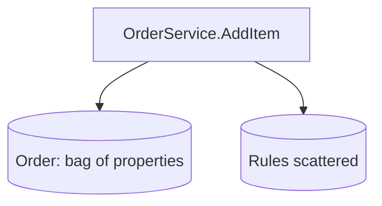
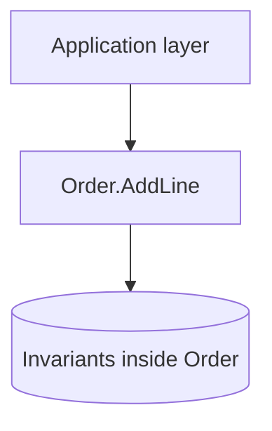
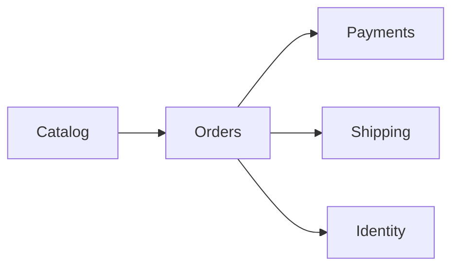
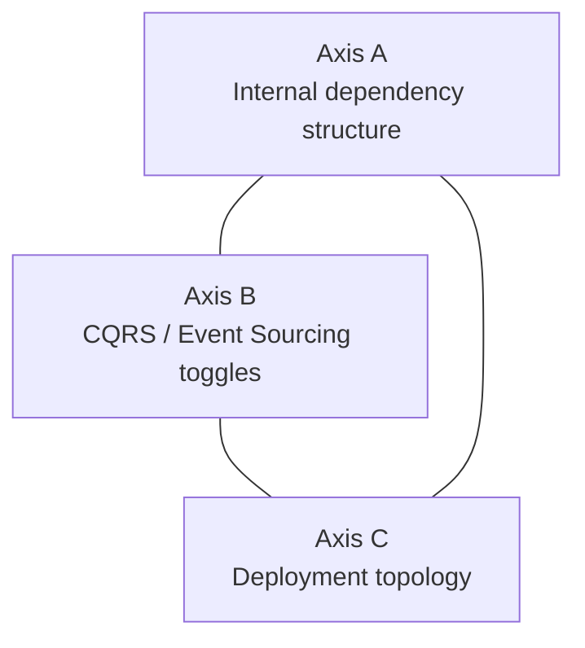
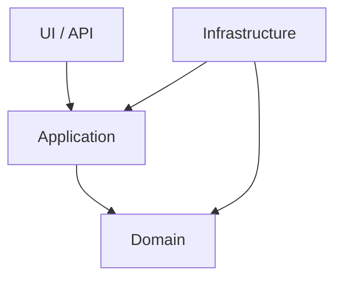
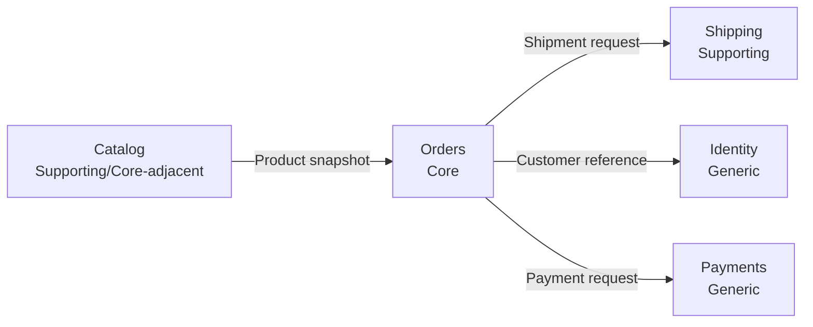

# DDD: A Way of Thinking

### (and the Architectures It Can Live In)

<!--
What to say:

<br />
"Today is a strategy-first introduction to DDD. The goal is not memorizing patterns, and it is not choosing one architecture template."
"By the end, I want you to be able to separate domain thinking from architecture decisions."
"Keep one sentence in mind from the start: DDD is mainly about how we think about the problem space."
-->

---
layout: center
class: text-center
---

## What This Session Is (and Is Not)

<br />

- Intro-level framing focused on DDD thinking and trade-offs
- C#/.NET examples are there to illustrate ideas, not to teach syntax
- We stay in one running e-commerce domain throughout for continuity

<!--
What to say:

<br />
"This is an intro framing: we focus on DDD thinking and trade-offs."
"The C#/.NET examples are only a vehicle for ideas, not a language lesson."
"We will stay in one e-commerce domain on purpose so we don't keep paying context-switch cost."
"That continuity is deliberate: one model, many viewpoints."
-->

---
layout: center
class: text-center
---

## The Thesis

> **DDD is a way of thinking about software, not an architecture.**

<br />

- Strategic design is architecture-agnostic
- Tactical patterns are optional tools, not the goal
- DDD pairs with many architectures; it is none of them

<!--
What to say:

<br />
"I want to state the thesis clearly: DDD is a way of thinking about software, not an architecture."
"Strategic design is architecture-agnostic. Tactical patterns are tools, not the objective."
"In this session, we will keep the same domain model and change architecture choices around it."
"If the model stays stable while architecture knobs change, the thesis is proven."
-->

---

## Agenda

<br />

| Block | Topic |
|---|---|
| 1 | Why DDD |
| 2 | Ubiquitous language and knowledge crunching |
| 3 | Bounded contexts and context mapping |
| 4 | Tactical design with one aggregate |
| 5 | Architecture: three orthogonal axes |
| 6 | Zoom-out domain picture |
| 7 | Recap, peer topics, Q&A |

<!--
What to say:

<br />
"Here is the route for today. Blocks 0 to 3 establish the strategic frame before we go deep into code."
"Then Block 4 gives one worked aggregate, and Block 5 proves the thesis with the three-axis architecture view."
"Pacing check: around the 1-hour mark we should be finishing Block 2; around the 2-hour mark we should be finishing Block 4."
"If we are behind, we trim depth, not the thesis spine."
-->

---
layout: section
---

## Block 1 — Why DDD

<!--
What to say:

<br />
"Before definitions, let's start with pain everyone has seen."
"If the pain is not concrete, DDD sounds academic."
"This block is about why DDD exists at all."
-->

---

## Two Kinds of Complexity

<br />

- Accidental complexity: tools, frameworks, and incidental mechanics
- Essential complexity: business rules, policies, and language
- DDD targets essential complexity; frameworks can reduce technical friction but cannot eliminate business complexity

<!--
What to say:

<br />
"There are two kinds of complexity: accidental and essential."
"Accidental complexity comes from tools, frameworks, and plumbing. Essential complexity comes from the business itself."
"DDD helps us handle essential complexity by modeling it clearly. Frameworks can reduce technical friction, but they cannot eliminate business complexity."
-->

---

## Why Teams Still Struggle

<br />

- Business says one thing, code says another, database says a third
- Behavior leaks into services and scripts instead of the model
- Complexity grows, then velocity drops, then quality drops

<!--
What to say:

<br />
"This is where teams usually suffer: business language says one thing, code says another, data model says a third."
"Then behavior leaks into random services and handlers, and nobody knows where the real rules live."
"Velocity drops not because people are weak, but because the model is unclear."
-->

---

## Anemic vs Rich Model (Same Order Feature)

<br />

<div class="compare-graphs">

<div class="graph-card">

#### Anemic Flow



</div>

<div class="graph-card">

#### Rich Flow



</div>

</div>

<!--
What to say:

<br />
"On the left is an anemic flow: service methods and scattered rule checks control everything."
"On the right is a richer flow: behavior and invariants are centered in Order."
"Notice: same feature, different model quality."
"We will come back to this exact Order idea in Block 4 with .NET code."
-->

---

## Symptoms of the Anemic Application

<br />

- Translation tax between business language and implementation
- Rules duplicated across handlers and services
- "Big ball of mud" appears gradually, not suddenly

<!--
What to say:

<br />
"These are the signals to watch for: translation tax, duplicated rules, and gradual mud accumulation."
"The important part is gradual. Teams rarely choose a big ball of mud; they drift into it."
"Naming these symptoms helps us intervene early."
-->

---

## Where DDD Pays Off (and Where It Does Not)

<br />

- Strong fit: when the domain itself is the hard part
- Weak fit: simple CRUD, thin integrations, throwaway tooling
- DDD is not mandatory for every project

<!--
What to say:

<br />
"DDD is not mandatory for every project."
"Use it when the domain is the hard part and wrong modeling becomes expensive."
"For simple CRUD or short-lived tooling, lighter approaches are often the right choice."
"This is a proportionality decision, not ideology."
-->

---
layout: center
class: text-center
---

## Bridge to Strategy First

> Tactical patterns without strategic design are a local optimization.

- Next: language, bounded contexts, and context mapping before code

<!--
What to say:

<br />
"From here, we go strategy-first: language, bounded contexts, and context mapping."
"That sequence is intentional. If we start with code, people leave thinking DDD equals C# patterns."
"Next two blocks are where the real framing lands."
-->

---
layout: center
class: text-center
---

## Thesis Checkpoint (End of Block 1)

> **DDD is a way of thinking, not an architecture and not a checklist.**

<!--
What to say:

<br />
"Checkpoint: DDD is a way of thinking, not an architecture and not a checklist."
"If we only collect tactical artifacts, we miss the point."
"Now let's do strategic design properly before touching tactical depth."
-->

---
layout: section
---

## Block 2 — Ubiquitous Language and Knowledge Crunching

<!--
Remind: diagram-only, zero C#.
-->

---

## Ubiquitous Language

- One shared language across experts, developers, docs, and code
- If language diverges, the model drifts
- Naming is design, not cosmetics

<!--
Stress non-negotiable nature of shared language.
-->

---

## Language Drift Is a Model Bug

| Conversation | Code | Risk |
|---|---|---|
| "Submit order" | `HandleOrderCommand()` | Intent blurred |
| "Reserve inventory" | `UpdateStock()` | Policy hidden |
| "Payment authorized" | `SetStatus(3)` | Meaning lost |

<!--
No code samples; keep this conceptual and vocabulary-driven.
-->

---

## Knowledge Crunching

- The model is discovered with domain experts
- Developers must learn business constraints, not just APIs
- Modeling is collaborative and iterative

<!--
Use Evans framing: discovered, not invented.
-->

---

## Event Storming (3-Minute Taste)


- Orange-stickies mindset: events reveal process and vocabulary
- Full method is a peer-study topic, not a deep dive here

<!--
Keep this intentionally light; it demonstrates discovery mindset.
-->

---

## The Model Is the Design

- Conversations, diagrams, and implementation must say the same thing
- If terms conflict, fix language before adding patterns
- Precision in words prevents accidental architecture debates

<!--
Tie language quality to design quality.
-->

---

## Mini Exercise Prompt

Two descriptions of the same behavior:

- A technical phrasing with generic verbs
- A domain phrasing with explicit business intent

Question: which one would a domain expert validate faster?

<!--
Run quick audience interaction on wording quality.
-->

---

## Debrief: What Usually Changes

- Generic verbs become domain verbs
- Data fields become domain concepts
- Hidden policies become explicit rules

<!--
Reinforce habit: better names expose better model boundaries.
-->

---
layout: center
class: text-center
---

## Strategy Before Tactics

> Keep this order: language first, boundaries second, code third.

<!--
Set up Block 3 directly.
-->

---
layout: center
class: text-center
---

## Break 1 (10 minutes)

<!--
Break marker.

<br />
Resume with bounded contexts and context mapping.
-->

---
layout: section
---

## Block 3 — Strategic Design: Bounded Contexts and Context Mapping

<!--
State this is the heart of the talk.
-->

---

## Why One Big Model Fails

- Same term can mean different things across business capabilities
- Shared model pressure creates ambiguity and compromise everywhere
- Large systems need explicit semantic boundaries

<!--
Give examples: Customer in sales/support/billing.
-->

---

## Bounded Context: The Core Idea

- Inside the boundary, language and model are consistent
- A bounded context owns its model and code
- Crossing boundaries requires translation decisions

<!--
Define clearly and briefly.
-->

---

## Same Word, Different Meanings

| Context | "Product" Means |
|---|---|
| Catalog | Marketable item, attributes, merchandising state |
| Orders | Purchasable line item and price snapshot |
| Shipping | Physical parcel characteristics and constraints |

<!--
Use running e-commerce domain only.
-->

---

## Running Domain Context Map



<!--
Introduce the five contexts used for the rest of the deck.
-->

---

## Subdomains: Core, Supporting, Generic

- Core: where the business differentiates and wins
- Supporting: necessary but not differentiating
- Generic: solved commodities (buy, OSS, platform)

<!--
Ask audience what they think is core in this domain.
-->

---

## Strategic Question for Our Domain

| Context | Likely Subdomain Type |
|---|---|
| Orders | Core candidate |
| Catalog | Supporting or core-adjacent |
| Shipping | Supporting |
| Identity | Generic |
| Payments | Generic (often external) |

<!--
Frame as hypothesis for discussion, not immutable truth.
-->

---

## Proportional Rule (Preview)

- Core earns deeper modeling and stronger architecture boundaries
- Supporting/generic may use lighter patterns safely
- Choosing less architecture is not DDD-lite

<!--
Use exact framing from plan.
-->

---

## Context Mapping Relationships

- Partnership
- Shared Kernel
- Customer-Supplier
- Conformist
- Anticorruption Layer (ACL)
- Open Host Service / Published Language
- Separate Ways

<!--
Name the set; focus practical importance on ACL.
-->

---

## ACL Focus: The Practical Lifesaver

- Protect your model from foreign terminology and constraints
- Translate external contracts into your own language
- Localize integration volatility at the boundary

<!--
Emphasize this pattern as high-leverage for teams.
-->

---

## Group Exercise: Spot the Boundaries

- Read one overloaded e-commerce narrative
- In pairs, draw bounded contexts
- Add one context-map relationship

Timebox:
- 8 minutes work
- 4 minutes debrief

<!--
This is the last thing to cut if behind.
-->

---

## Debrief Prompts

- Where did language conflicts appear first?
- Which boundary was hardest to separate?
- Where would you place an ACL and why?

<!--
Collect 2-3 team answers.
-->

---
layout: center
class: text-center
---

## Thesis Checkpoint (End of Block 3)

> **Strategic DDD is architecture-agnostic; that is why DDD is a way of thinking, not an architecture.**

<!--
Return to thesis explicitly at end of block.
-->

---
layout: center
class: text-center
---

## Break 2 (10 minutes)

<!--
Break marker.
After break: .NET 10 tactical modeling with one aggregate.
-->

---
layout: section
---

## Block 4 — Tactical Design: One Worked Aggregate in .NET 10

<!--
State constraint: one aggregate only, Order + OrderLine.
-->

---

## Start from One Consistency Boundary

- Aggregate root: `Order`
- Child entity/value composition: `OrderLine`, `Money`, `Address`
- Every rule change flows through `Order`

<!--
Introduce structure before details.
-->

---

## Value Object Emerges: Money

```csharp
public readonly record struct Money(decimal Amount, string Currency)
{
    public static Money Zero(string currency) => new(0m, currency);

    public Money Add(Money other)
    {
        if (Currency != other.Currency) throw new InvalidOperationException();
        return new Money(Amount + other.Amount, Currency);
    }
}
```

<!--
Say contrast line: this used to be dozens of lines of equality boilerplate.
-->

---

## Value Object Emerges: Address

```csharp
public sealed record Address(
    string Street,
    string City,
    string State,
    string PostalCode,
    string Country);
```

<!--
Keep concise; focus on semantic modeling, not plumbing.
-->

---

## Strongly Typed Identity

```csharp
public readonly record struct OrderId(Guid Value)
{
    public static OrderId New() => new(Guid.NewGuid());
}
```

- Reference other aggregates by identity, not object reference

<!--
Connect to Vernon rule explicitly.
-->

---

## Entity Emerges: Order Owns Behavior

```csharp
public sealed class Order
{
    private readonly List<OrderLine> _lines = [];

    public OrderId Id { get; }
    public IReadOnlyList<OrderLine> Lines => _lines;

    public Order(OrderId id) => Id = id;
}
```

<!--
Identity-based entity, private mutable internals, read-only exposure.
-->

---

## Aggregate Rule: Mutate Lines Through Order

```csharp
public void AddLine(string sku, int quantity, Money unitPrice)
{
    if (quantity <= 0) throw new ArgumentOutOfRangeException(nameof(quantity));
    if (_lines.Any(l => l.Sku == sku)) throw new InvalidOperationException("Duplicate SKU");

    _lines.Add(new OrderLine(sku, quantity, unitPrice));
}
```

<!--
Show invariant protection and aggregate boundary in one method.
-->

---

## Domain Event Emerges from Behavior

```csharp
public sealed record OrderPlaced(OrderId OrderId, DateTimeOffset OccurredAtUtc);

public void Submit()
{
    if (_lines.Count == 0) throw new InvalidOperationException("Order is empty");
    _domainEvents.Add(new OrderPlaced(Id, DateTimeOffset.UtcNow));
}
```

<!--
Differentiate domain event from integration event verbally.
-->

---

## Repository Is a Domain Port

```csharp
public interface IOrderRepository
{
    Task<Order?> GetById(OrderId id, CancellationToken ct);
    Task Save(Order order, CancellationToken ct);
}
```

- One repository per aggregate root, not per table

<!--
Keep infra implementation for Block 5 axis discussion.
-->

---

## Domain Service and Factory (Short Callouts)

- Domain service: logic that belongs to no single entity
- Factory: non-trivial aggregate creation with invariants
- Guardrail: do not move core behavior out of `Order` into services

<!--
Warn against returning to anemic model.
-->

---
layout: center
class: text-center
---

## Frameworks Are Plumbing

> EF Core and MediatR can help, but they are not the story.

<!--
Say this explicitly to protect thesis and modeling focus.
-->

---
layout: section
---

## Block 5 — Architecture as Proof: Three Orthogonal Axes

<!--
State explicitly: not five rival architectures, three independent knobs.
-->

---

## The Three Axes Model



- We will turn each axis while keeping the same `Order` model

<!--
Name Graça explicit architecture framing.
-->

---

## Axis A: One Idea, Four Vocabularies


- Additive progression, not a menu of rivals

<!--
Explain progression as composable refinement.
-->

---

## Axis A Invariant

- Domain at the center
- Dependencies point inward
- Dependency graph is acyclic



<!--
State this as architecture law across vocabularies.
-->

---

## Same Order, Different Outside

```csharp
public sealed class EfOrderRepository(AppDbContext db) : IOrderRepository
{
    public Task<Order?> GetById(OrderId id, CancellationToken ct)
        => db.Orders.SingleOrDefaultAsync(o => o.Id == id, ct);

    public async Task Save(Order order, CancellationToken ct)
        => await db.SaveChangesAsync(ct);
}
```

- `Order` and `IOrderRepository` stay stable while adapters change

<!--
Demonstrate port/adapter with same aggregate continuity.
-->

---

## How Much Axis A Is Enough?

- Start with layered + rich model when small
- Add hexagon/onion/clean ceremony as complexity earns it
- This is deliberate proportionality, not DDD-lite

<!--
Explicitly preserve DDD-lite definition from earlier.
-->

---

## Axis B: Orthogonal Toggles

- CQRS: split read and write models when needed
- Event Sourcing: store facts/events instead of latest state
- Both can be on or off independently of Axis A

<!--
Keep concise and non-dogmatic.
-->

---

## Axis B in One View

| Toggle | Off | On |
|---|---|---|
| CQRS | Shared model | Separate read/write paths |
| Event Sourcing | Current state persistence | Event log + projections |

<!--
Position as tactical choice, not architecture identity.
-->

---

## Axis C: Deployment Topology

- Monolith
- Modular monolith
- Microservices

- Strategic DDD tells you where boundaries may exist
- It never mandates microservices

<!--
Warn about distributed monolith risk.
-->

---

## Boundaries and Deployment Are Related, Not Equal

- Bounded contexts can live inside one deployable unit
- A microservice without a real bounded context is still coupled
- A modular monolith can implement strategic DDD well

<!--
Clarify common misconception.
-->

---
layout: center
class: text-center
---

## Thesis Checkpoint (End of Block 5)

> Three axes. We turned every knob. DDD's tactical patterns never left the center of Axis A; its strategic patterns steered Axis C; DDD itself sat on none of the three.

> **Same model, every time. That is the talk.**

<!--
Use the plan closing line as written.
-->

---
layout: center
class: text-center
---

## Block 6 — Zoom Out: The Whole Domain in One Picture

<!--
No new example; this is synthesis.
-->

---

## Final Context Map (Zoomed Out)



<!--
Show full map with relationship intent labels.
-->

---

## Locate the Worked Aggregate

<br />

- `Order` aggregate lives in the `Orders` bounded context
- `IOrderRepository` is a domain port in `Orders`
- EF Core adapter sits outside the domain boundary

<!--
Connect Block 4 and Block 5 artifacts back to strategy map.
-->

---

## What Stayed Constant All Afternoon

<br />

- Domain language
- Consistency boundary (`Order`)
- Strategic boundaries (contexts and relationships)

What changed:

- Internal dependency shape
- Optional toggles (CQRS/Event Sourcing)
- Deployment topology

<!--
Make invariants versus variables explicit.
-->

---
layout: center
class: text-center
---

## Process Over Preference

> We never had to commit to one architecture to do strategic DDD.

<!--
Short synthesis line before recap.
-->

---
layout: center
class: text-center
---

## Block 7 — Recap, Peer Study Topics, Q&A

<!--
Close with takeaways and next learning steps.
-->

---

## Five Takeaways

<br />

1. The domain is the point; everything else serves it.
2. Ubiquitous language is non-negotiable.
3. Strategic design comes before tactical design.
4. Aggregates are consistency boundaries; keep them small.
5. DDD is a way of thinking, not an architecture.

<!--
Read the five as final memory anchors.
-->

---
layout: center
---

## DDD-lite: Final Warning

<br />

- DDD-lite happens when teams keep tactical patterns but skip strategic design
- If language, boundaries, and context map are missing, clarity will not survive
- Choosing lighter architecture is fine; skipping strategy is the real trap

<!--
What to say:

<br />
"Now that we have seen the full flow, this is the warning to keep."
"DDD-lite is not about being pragmatic with architecture size; it is about dropping strategy."
"If language and boundaries are weak, tactical code alone will not save the model."
-->

---

## Peer Study Topics (1-7)

<br />

1. Event Storming
2. Aggregate design deep dive
3. CQRS in practice
4. Event Sourcing
5. Anticorruption layers in real integrations
6. Explicit Architecture in .NET
7. Domain vs integration events

<!--
Mention first-claim ownership model for topics.
-->

---

## Peer Study Topics (8-13)

<br />

8. Bounded contexts vs microservices
9. Strategic design workshop
10. Sagas / Process managers
11. DDD in functional .NET / F#
12. Testing domain models in .NET
13. Vertical Slice Architecture in .NET

<!--
Connect to plan's peer list without adding topics.
-->

---

## Reading Order for Presenters

<br />

1. Vernon Distilled (strategy-first frame)
2. Relevant Vernon Red Book chapter (implementation detail)
3. Evans for philosophy and vocabulary
4. One modern article/talk for updated examples

<!--
Give practical next-step sequence.
-->

---

## Q&A Prompt If Room Is Quiet

<br />

- Where is a bounded context missing in your current system?
- Where are you accidentally doing DDD-lite by skipping strategy?

<!--
Use this to trigger practical discussion.
-->

---
layout: center
class: text-center
---

## Thesis Checkpoint (End of Block 7)

> **DDD is a way of thinking about software, not an architecture.**

<!--
Final repetition of thesis as closing sentence.
-->
