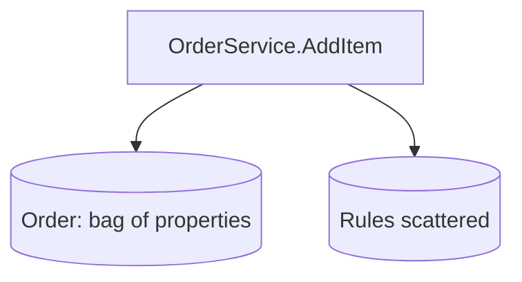
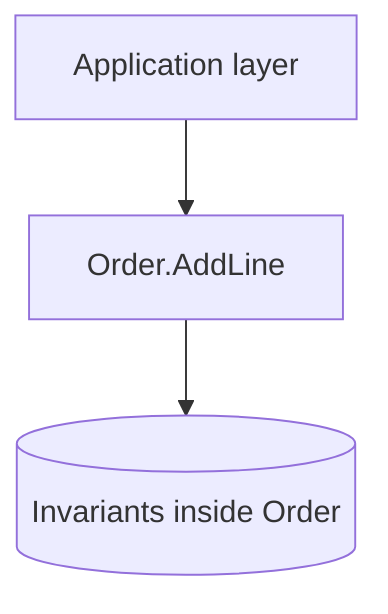
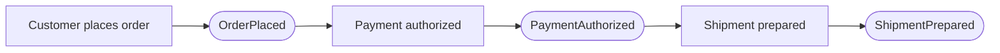
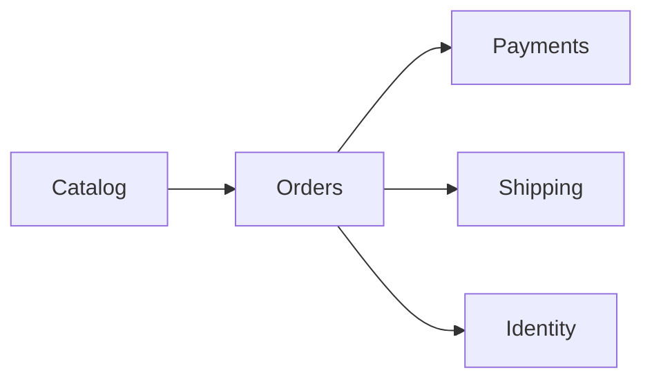
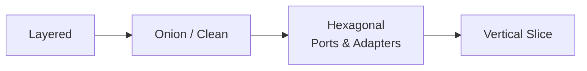
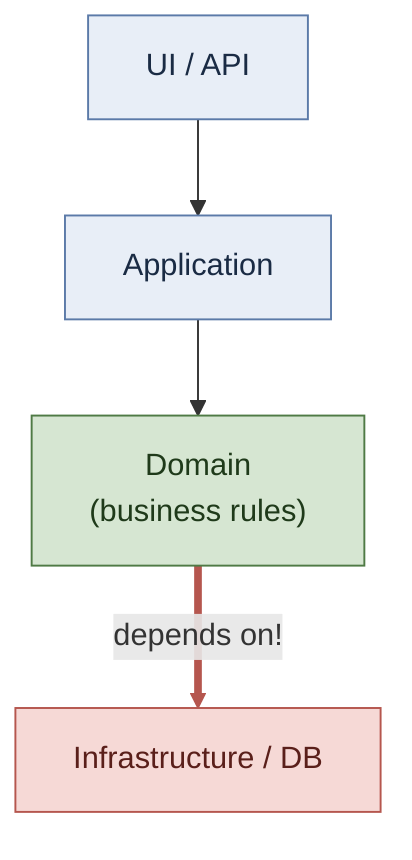
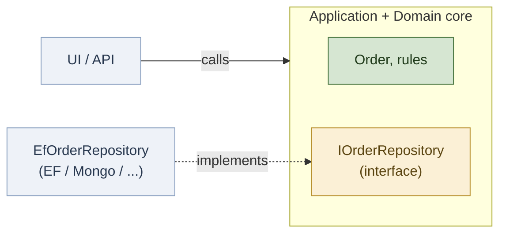
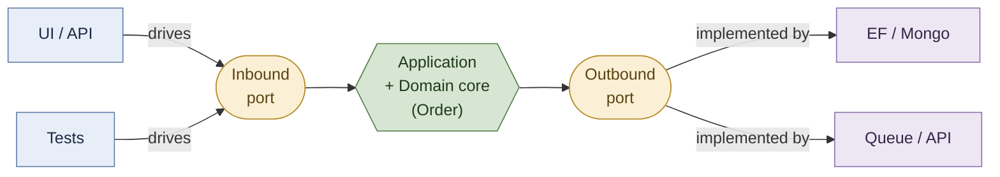
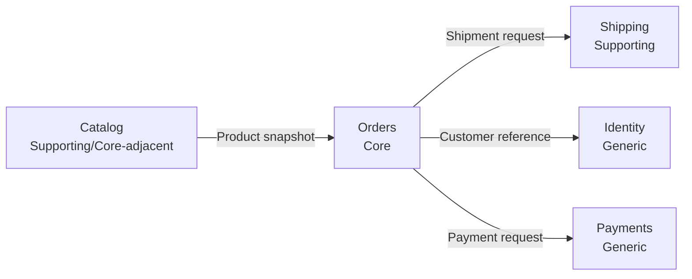

# DDD: A Way of Thinking

### (and the Architectures It Can Live In)

<!--
What to say:

<br />
"Today is a strategy-first introduction to DDD. The goal is not memorizing patterns, and it is not choosing one architecture template."
"When we talk about architecture here, we mean the structure inside a single service — folder organization and how layers depend on each other — not deployment topology, replicas, or how services talk to each other."
"By the end, I want you to be able to separate domain thinking from architecture decisions."
"Keep one sentence in mind from the start: DDD is mainly about how we think about the problem space."
"Let me frame quickly what this session is, and is not."
-->

---
layout: center
class: text-center
---

## What This Session Is (and Is Not)

<br />

- Introduction on DDD thinking and trade-offs
- We stay in one running e-commerce domain throughout for continuity

<!--
What to say:

<br />
"This is an intro framing: we focus on DDD thinking and trade-offs, not pattern trivia."
"And the big one: we stay in ONE e-commerce domain the entire time. Same story from the first slide to the last, so we never pay context-switch cost."
"That continuity is the whole design of this talk: one model, many viewpoints."
"With that, the single sentence everything hangs on — the one idea."
-->

---
layout: center
class: text-center
---

## The Big Idea

> **DDD is a way of thinking about software, not an architecture.**

<br />

- Strategic design is architecture-agnostic
- DDD pairs with many architectures; it is none of them

<!--
What to say:

<br />
"State it plainly: DDD is a way of thinking about software, not an architecture."
"Strategic design is architecture-agnostic — DDD pairs with many architectures and is none of them."
"Here is how we will earn that, not just say it: we keep one domain model fixed and turn every architecture knob around it."
"If the model stays stable while the architecture changes underneath it, that's the whole point — and it's literally how the afternoon is built."
"Here is the route."
-->

---

## Agenda

<br />

| Block | Topic |
|---|---|
| 0 | The domain we will model |
| 1 | Why DDD |
| 2 | Ubiquitous language and knowledge crunching |
| 3 | Bounded contexts and context mapping |
| 4 | Tactical design: identifying and building one aggregate |
| 5 | Architecture: one model, an evolving structure (with code) |
| 6 | The whole picture, takeaways, and where to go next |

<!--
What to say:

<br />
"Here is the route for today. Blocks 0 to 3 establish the strategic frame before we go deep into code."
"Then Block 4 gives one worked aggregate, and Block 5 brings it home by walking the architecture evolution with real code."
"Pacing check: around the 1-hour mark we should be finishing Block 2; around the 2-hour mark we should be finishing Block 4."
"If we are behind, we trim depth, not the core message."
"But before any of that, we need a domain to talk about — so let's meet it."
-->

---
layout: section
---

## Block 0 — The Domain We Will Model

<!--
What to say:

<br />
"Everything today derives from one concrete business. We meet it first, before any theory."
"If you only remember one slide from the next few, remember the story slide — every diagram and every line of code we write comes back to it."
"Let's read the business."
-->

---

## The Business We're Modeling

<br />

A mid-size online retailer (an online store).

- A customer browses a **catalog** of products and adds items to an **order**
- An order cannot be submitted **empty**, and the same product cannot appear **twice** as separate lines
- Before anything ships, **payment must be authorized**
- Stock is **limited**, so items are **reserved** when the order is placed
- Once payment clears, a **shipment** is prepared and dispatched to the customer's **address**
- The same word — **"Product"** — means different things to merchandising (catalogue/sales), to the order, and to the warehouse

<!--
What to say:

<br />
"Here is the whole business in six sentences. This is our entire afternoon, compressed."
"It is deliberately small and deliberately ordinary — an online store. Nobody needs domain expertise to follow it."
"But notice it is not a feature list. It is full of rules and full of words. 'Cannot be empty.' 'Cannot appear twice.' 'Must be authorized before shipping.' 'Reserved because stock is limited.'"
"And notice the last line already: the word Product is doing three different jobs. Hold onto that — it is the seed of a whole block."
"Everything from here on is just us being disciplined about this paragraph. Next, let's pull the language out of it."
-->

---

## Extract the Language

<br />

Same story, with the recurring words pulled out:

<div class="compare-graphs">

<div class="graph-card">

#### Nouns (things)

- Customer, Catalog, Product
- Order, OrderLine
- Payment, Shipment, Address

</div>

<div class="graph-card">

#### Verbs (behavior)

- Browse, Add, Submit
- Authorize (payment)
- Reserve (stock)
- Prepare / Dispatch (shipment)

</div>

</div>

<!--
What to say:

<br />
"This is knowledge crunching in miniature, and we are doing it right now, not describing it."
"I did nothing clever here. I reread the same six sentences and underlined every word the business actually said."
"The nouns are candidate concepts. The verbs are candidate behaviors — and notice the verbs are specific: not 'update', but 'reserve'; not 'set status', but 'authorize'."
"This list is the ubiquitous language. It is not invented; it is discovered by listening to the story."
"But a pile of words is not a model yet. The next slide is about what we are deliberately NOT doing yet."
-->

---

## The Rules Hiding in the Story

<br />

The narrative is full of invariants, stated in plain business words:

| Rule (business words) | Lives where? |
|---|---|
| An order cannot be submitted empty | Inside `Order` (tactical design) |
| The same product cannot appear twice | Inside `Order` (tactical design) |
| Payment must be authorized before shipping | Cross-context policy (bounded contexts) |
| Limited stock must be reserved | Catalog/Inventory boundary (bounded contexts) |

<!--
What to say:

<br />
"One more reading of the same paragraph, looking only for rules. Every one of these came straight from a sentence on the story slide."
"This is the most important setup in the deck. We are planting four rules now, in business language, with no code anywhere."
"Two of them are about a single order's internal consistency — empty, duplicates. Hold those: in the tactical design section they literally become two methods on an Order class. You will see this exact table again."
"The other two are not about one order — they cross between parts of the business. Those will tell us where the boundaries are when we get to bounded contexts."
"So we now have a story, a language, and a set of rules — all from one paragraph. That is enough to start asking why this is hard. That is Block 1."
-->

---
layout: section
---

## Block 1 — Why DDD

<!--
What to say:

<br />
"We have a domain now, so the pain can be concrete instead of academic."
"Before definitions, let's start with pain everyone in this room has seen."
"This block is about why DDD exists at all — and we will keep pointing back at our retailer story to make it real."
"Let's start with two kinds of complexity."
-->

---

## Two Kinds of Complexity

<br />

- Accidental complexity: tools, frameworks, and technical plumbing
- Essential complexity: business rules, policies, and language
- DDD targets essential complexity; frameworks can reduce technical friction but cannot eliminate business complexity

<!--
What to say:

<br />
"There are two kinds of complexity: accidental and essential."
"Accidental complexity is the tools and plumbing — the database driver, the serializer, the DI container."
"Essential complexity is the business itself. In our story, 'payment must be authorized before shipping' is essential — it is true no matter what language or framework we pick."
"No framework removes that rule. DDD's job is to model essential complexity clearly; frameworks only reduce the accidental kind."
"So if the hard part is essential, why do good teams still end up in a mess? Next slide."
-->

---

## Why Teams Still Struggle

<br />

- Business says one thing, code says another, database says a third
- Behavior leaks into services and scripts instead of the model
- Complexity grows, then velocity drops, then quality drops

<!--
What to say:

<br />
"This is where teams usually suffer. The business says 'reserve stock', the code says 'UpdateQuantity', the database column is called 'qty_2'. Three languages for one idea."
"Then the rule 'no duplicate product line' ends up half in a controller, half in a SQL constraint, and nobody knows where it really lives."
"Velocity does not drop because people are weak. It drops because the model is unclear, so every change means re-deriving the business in your head."
"Let's make that concrete with the exact Order feature from our story."
-->

---

## Anemic vs Rich Model (Same Order Feature)

<br />

<div class="compare-graphs">

<div class="graph-card">

#### Anemic Flow



</div>

<div class="graph-card">

#### Rich Flow



</div>

</div>

<!--
What to say:

<br />
"Same feature from our story — adding an item to an order — drawn two ways."
"On the left, anemic: an OrderService pokes at an Order that is just a bag of properties, and the 'no duplicates' rule lives off to the side in some validator."
"On the right, rich: the application layer just calls Order.AddLine, and the rule lives inside Order where it cannot be bypassed."
"Same business feature, very different model quality. The right side is exactly the Order class we will write in Block 4."
"What does the anemic version cost you over time? Next slide names the symptoms."
-->

---

## Symptoms of the Anemic Application

<br />

- Translation tax between business language and implementation
- Rules duplicated across handlers and services
- "Big ball of mud" appears gradually, not suddenly

<!--
What to say:

<br />
"Three symptoms. Translation tax: you say 'authorize payment' in the meeting and write 'SetStatus(3)' in the code, and pay the gap every time."
"Duplicated rules: 'order cannot be empty' is checked in two controllers and a background job, and one day they disagree."
"And the big ball of mud, which is the important one: nobody chooses it. Teams drift into it one reasonable shortcut at a time."
"So is the answer 'always do DDD'? No — and the next slide is deliberately about when NOT to."
-->

---

## Where DDD Pays Off (and Where It Does Not)

<br />

- Strong fit: when the domain itself is the hard part
- Weak fit: simple CRUD, thin integrations, throwaway tooling
- DDD is not mandatory for every project

<!--
What to say:

<br />
"DDD is not mandatory for every project, and saying so out loud protects the rest of the talk from sounding like ideology."
"Strong fit: the domain itself is the hard part — like the reservation and payment-before-shipping rules in our retailer. Getting those wrong is expensive."
"Weak fit: a settings screen, a thin CSV import, a throwaway script. There the domain is trivial; lighter approaches win."
"This is a proportionality call, not a religion. Keep that in mind for the architecture block especially."
"Before we go strategic, one quick promise — so the abstract part has a destination."
-->


---

## Where We Are Headed

<br />

By the end, this will be our `Order` — every line earned, not assumed:

```csharp
public void AddLine(string sku, int quantity, Money unitPrice)
{
    if (quantity <= 0) throw new ArgumentOutOfRangeException(nameof(quantity));
    if (_lines.Any(l => l.Sku == sku)) throw new InvalidOperationException("Duplicate SKU");

    _lines.Add(new OrderLine(sku, quantity, unitPrice));
}
```

> Do not study this now. We earn it: language first, boundaries next, then we build it.

<!--
What to say:

<br />
"Twenty seconds, then we move on. This is where we are going — the finished Order from the end of the talk."
"I am showing it now on purpose: the next stretch is strategic and has no code, and I want you to have a concrete destination in your head while we do the abstract work."
"Do not read it closely. Just notice it is small, and notice the business rules are right there inside it — no duplicates, positive quantity. You will see this exact method again, and by then every line will be obvious."
"Park the image. Now the discipline that makes it possible: language."
-->


---
layout: section
---

## Block 2 — Ubiquitous Language and Knowledge Crunching

<!--
What to say:

<br />
"We already did this once, informally, in Block 0 when we underlined the words in the story. This block names the discipline behind that move."
"No code in this block at all — this is purely about language."
"Let's start with what 'ubiquitous language' actually demands."
-->

---

## Ubiquitous Language

<br />

- One shared language across experts, developers, docs, and code
- If language diverges, the model drifts
- Naming is design, not cosmetics

<!--
What to say:

<br />
"One language, used everywhere: the expert's sentence, the developer's class name, the diagram, the docs. Not 'a glossary somewhere' — the actual words in the code."
"If those drift apart, the model drifts with them. The code slowly stops describing the business."
"So naming is not cosmetics. Naming is design. The word 'reserve' in our story is a design decision, not a label."
"Here is what drift actually looks like."
-->

---

## Language Drift Is a Model Bug

<br />

| Conversation | Bad Code | Better Code | Risk |
|---|---|---|---|
| "Submit order" | `HandleOrderCommand()` | `SubmitOrder()` | Intent blurred |
| "Reserve inventory" | `UpdateStock()` | `ReserveInventory()` | Policy hidden |
| "Payment authorized" | `SetStatus(3)` | `AuthorizePayment()` | Meaning lost |

<!--
What to say:

<br />
"Every row here is a line from our own story. The business says 'submit order', 'reserve inventory', 'payment authorized' — those are the exact phrases from Block 0."
"Middle column is the drift: HandleOrderCommand, UpdateStock, SetStatus(3). Each one technically works and each one quietly loses the business meaning."
"Right column just uses the words the business already gave us. No cleverness — we are only refusing to translate."
"The risk column is the point: when the word is lost, the rule behind it gets lost too. That is a model bug, not a naming nitpick."
"Where do these good words come from in the first place? That is knowledge crunching."
-->

---

## Knowledge Crunching

<br />

- The model is discovered with domain experts
- Developers must learn business constraints, not just APIs
- Modeling is collaborative and iterative

<!--
What to say:

<br />
"Knowledge crunching is Evans' term for what we did to the story slide: you sit with the people who know the business and grind the narrative down until the real concepts surface."
"The key word is discovered, not invented. We did not decide an order cannot be empty — the business told us, and we listened hard enough to write it down."
"Developers have to learn the constraints, not just the API surface. It is collaborative and it is iterative; the model on slide one is never the final model."
"There is a fast, visual way to do this with a room full of people — let's taste it."
-->

---

## Event Storming (3-Minute Taste)

<br />



- Think in events (things that happened): they reveal the process and the vocabulary
- Full method is a peer-study topic, not a deep dive here

<!--
What to say:

<br />
"This is our story again, drawn as a timeline of events: order placed, payment authorized, shipment prepared. Same words, nothing new invented."
"Event Storming is just this with a wall and orange stickies and the business in the room. The events expose the process and the vocabulary at the same time."
"We are keeping it to a taste on purpose — there is a full peer-study topic on it later. The point here is the discovery mindset, not the technique."
"Whatever method you use, the output has to obey one rule, on the next slide."
-->

---

## The Model Is the Design


<br />

- Conversations, diagrams, and implementation must say the same thing
- If terms conflict, fix language before adding patterns
- Precision in words prevents accidental architecture debates

<!--
What to say:

<br />
"Evans' line: the model is the design. The conversation, the diagram, and the C# we write in Block 4 must all say the same thing."
"If the words conflict — and they will, we already smell it with 'Product' — you fix the language before you reach for a pattern. A clever pattern on top of a confused word just hides the confusion."
"Most so-called architecture arguments are actually unresolved language arguments. Precision in words prevents them."
"Let's make you feel that with a 60-second exercise on our own domain."
-->

---

## Mini Exercise Prompt


<br />

Our story says: *"the same product cannot appear twice as separate lines."*

Two ways to name the code:

- `ValidateLines(order)` — generic, says nothing about the rule
- `Order.AddLine(...)` that rejects a duplicate product — domain intent

Question: which one would a business person recognise as their rule?

<!--
What to say:

<br />
"Take our actual rule — same product cannot appear twice. Here are two ways to express it in code."
"Show of hands: which one could you read out loud to a non-technical business owner and have them say 'yes, that is exactly the rule'?"
"The first is a generic validator — it could be checking anything. The second names the action and the rule lives inside it."
"That gap is the translation tax from earlier, made personal. Here is what teams always discover when they do this."
-->


---
layout: section
---

## Block 3 — Strategic Design: Bounded Contexts and Context Mapping

<!--
What to say:

<br />
"This is the heart of the talk. If you remember one block for strategic value, this is it."
"And we are not going to declare boundaries — we are going to let the story's own language force them on us."
"Start with why a single shared model fails."
-->

---

## Why One Big Model Fails

<br />

- One shared `Product` class means Catalog, Orders, and Shipping all negotiate every change
- Each context needs `Product` to behave differently — editable price vs. frozen price, display name vs. weight
- The shared class becomes a compromise full of fields that only some contexts use

<!--
What to say:

<br />
"The instinct is one big tidy model: one Product class, one Customer class, everyone shares them."
"It fails because each context needs Product to behave differently. Catalog owns the full product — name, images, price, weight — it is the source of truth. But Orders does not want a live reference to Catalog's Product; it wants a frozen snapshot: the name and price at the moment the customer bought it, immutable. Shipping wants weight and dimensions, nothing else."
"So Catalog publishes, and the others take a snapshot and own their copy. That arrow on the context map that says 'Product snapshot' is exactly this."
"Force one shared class instead, and every team negotiates every field change forever — and the class fills up with nulls that only some contexts use."
"Let's define the tool that makes this clean."
-->

---

## Bounded Context: The Core Idea

<br />

- Inside the boundary, language and model are consistent
- A bounded context owns its model and code
- Crossing boundaries requires translation decisions

<!--
What to say:

<br />
"A bounded context is a boundary inside which one language and one model are consistent. Inside it, 'Product' means exactly one thing."
"It owns its model and its code — it is not a namespace, it is a meaning boundary."
"And crossing one is never free: it forces a translation decision, which is the next topic, context mapping."
"Now watch our own story break. The word 'Product'."
-->

---

## Same Word, Different Meanings

<br />

| Context | "Product" Means |
|---|---|
| Catalog | Marketable item, attributes, merchandising state |
| Orders | Purchasable line item and price snapshot |
| Shipping | Physical parcel characteristics and constraints |

<!--
What to say:

<br />
"Do not read the table yet. Go back to our story slide in your head."
"Sentence one: the customer browses a CATALOG of products — there, a product is a marketable thing with a name, images, a price to show."
"Sentence two: a product is added to an ORDER — there it is a purchased line with a quantity and a price snapshot frozen at purchase time."
"Sentence five: a SHIPMENT is dispatched — there a product is a physical parcel with weight and dimensions."
"Same word, three meanings, and we did not invent that — we read it off the narrative. Now look at the table: it is just those three readings written down."
"Three meanings means three bounded contexts. The story drew this map; we are only transcribing it."
"So what is the full map?"
-->

---

## Running Domain Context Map

<br />



<!--
What to say:

<br />
"Here is the whole map, and every box came from a sentence in our story — none of it is arbitrary."
"Catalog: 'browses a catalog of products'. Orders: 'adds items to an order'. Payments: 'payment must be authorized'. Shipping: 'a shipment is dispatched'. Identity: 'the customer's address' — there is a customer who must be known."
"The arrows are the story's own flow: Catalog feeds Orders, Orders triggers Payments and Shipping and needs Identity. We did not design this graph; we read it."
"This exact map is the spine for the rest of the deck — Block 4 lives in one of these boxes, Block 5 moves the boxes around."
"Not all five boxes deserve equal effort, though. Which matter most?"
-->

---

## Subdomains: Core, Supporting, Generic

<br />

- Core: where the business differentiates and wins
- Supporting: necessary but not differentiating
- Generic: solved commodities (buy, OSS, platform)

<!--
What to say:

<br />
"Three buckets. Core: where the business actually wins and competes. Supporting: necessary, but nobody picks you for it. Generic: a solved commodity you should buy or pull off the shelf."
"Quick audience question before I show my answer: in our retailer, which of the five boxes is the one the business truly differentiates on? Shout it out."
"Hold your answer — let's test it on the next slide."
-->

---

## Strategic Question for Our Domain

<br />

| Context | Likely Subdomain Type |
|---|---|
| Orders | Core candidate |
| Catalog | Supporting or core-adjacent |
| Shipping | Supporting |
| Identity | Generic |
| Payments | Generic (often external) |

<!--
What to say:

<br />
"Here is my answer, with the reasoning tied straight back to the story."
"Orders is the core candidate: the hard rules in our narrative — cannot be empty, no duplicate line, reserve before you promise — all live here. This is where the business logic that makes us money concentrates."
"Catalog is supporting or core-adjacent: merchandising can be a differentiator, but the rules are lighter than Orders."
"Shipping is supporting: it has to work, but customers do not choose us for our parcel handling."
"Identity is generic: 'the customer's address' needs a known customer — but authentication is a solved problem, you buy it."
"Payments is generic and usually external: 'payment must be authorized' is real, but Stripe owns that complexity, not us."
"This is a hypothesis to argue about with the business, not a law. But notice the reasoning is always 'where does the story put the hard rules', never taste."
"That classification has a direct architectural consequence — next slide."
-->

---

## Proportional Rule (Preview)

<br />

- Core earns deeper modeling and stronger architecture boundaries
- Supporting/generic may use lighter patterns safely

<!--
What to say:

<br />
"Here is the rule that connects strategy to architecture, and we will reuse it in Block 5."
"The strategic and tactical DDD stays constant. What scales is how much architecture you wrap around it."
"Core — our Orders — earns the deep treatment: rich model, strong boundaries. Supporting and generic can be lighter: a thin layer, even plain CRUD, and that is correct, not lazy."
"Say this clearly: choosing less architecture is NOT DDD-lite. DDD-lite is dropping the strategic work — the language and the boundaries — which is exactly what we did NOT do."
"We have boundaries. Crossing them needs named relationships."
-->

---

## Context Mapping: What It Is

When two **bounded contexts** integrate, that relationship has a name. The catalogue of names is **context mapping**:

<div class="ctx-map-table">

| Pattern | What it is |
|---|---|
| **Partnership** | Two teams plan and succeed together |
| **Shared Kernel** | A small shared model both teams co-own |
| **Customer-Supplier** | Upstream team builds to the downstream's needs |
| **Conformist** | We just adopt the other side's model as-is |
| **Anticorruption Layer** | A translation layer protecting our model |
| **Open Host / Published Language** | A stable public contract for many consumers |
| **Separate Ways** | Deliberately no integration at all |

</div>

<style scoped>
.ctx-map-table table { font-size: 0.82em; }
.ctx-map-table td, .ctx-map-table th { padding-top: 0.28rem; padding-bottom: 0.28rem; }
</style>

<!--
What to say:

<br />
"We just earned our bounded contexts. The moment two of them have to talk, there is a relationship between them — and DDD gives those relationships names. That catalogue of names is what 'context mapping' means. Nothing more mystical than that."
"One line each, just so the names are not blurry when they come back. The first three are cooperative — two teams working together at different intensities. Conformist and Anticorruption Layer are the one-sided pair: with Conformist we bend to them, with an ACL we defend against them. Open Host is what a good public API is. Separate Ways is the honest 'these should not integrate' answer."
"Do not memorise this. The mistake everyone makes is treating these as seven things to pick from a list. The next slide fixes that — you do not pick, you ask questions."
-->

---

## Context Mapping: Ask Questions, Not Names

<br />

Do not start from the seven names. Start from three questions about the relationship:

1. **Who controls the contract** — us, them, or shared?
2. **Do we trust their model** enough to let its language into ours?
3. **How much do the two teams cooperate** day to day?

<br />

> The pattern is the *answer* to these questions, not something you pick first.

<!--
What to say:

<br />
"You never actually sit down and think 'which of the seven do I want'. You answer three questions about the relationship, and the pattern falls out."
"Who controls the contract — us, them, or is it jointly owned? Do we trust their model enough to speak their language inside ours? And how tightly do the two teams actually work together?"
"Answer those three honestly and the pattern is decided for you. But there is an even earlier question — what are you even looking at?"
-->

---

## First, What Are You Looking At?

<br />

| It is... | Then... |
|---|---|
| **Still our model**, just messy | Refactor — *not* context mapping |
| **Another bounded context** | Context mapping patterns apply |
| **A system we don't control** | Almost always an ACL |

<!--
What to say:

<br />
"Before any pattern, the most common mistake: people reach for context mapping when they do not actually have two contexts."
"Still our model, just messy? That is a refactor, not a boundary. Do not put a context map where you only need a cleaner class."
"Genuinely another bounded context — ours or a sibling team's? Now the seven patterns apply, decided by the three questions."
"A system we do not own — a vendor, a legacy box? You can almost pre-write the answer: Anticorruption Layer. It gets its own slide in a moment."
"So: place it in one of these three rows first, then ask the three questions. Here is how the answers map to the seven."
-->

---

## The Seven, Mapped to the Questions

<br />

| Situation | Pattern |
|---|---|
| Two teams succeed or fail together | **Partnership** |
| Two teams share a small model on purpose | **Shared Kernel** |
| They own the contract and care about us | **Customer-Supplier** |
| They own the contract, won't change for us | **Conformist** |
| They own it and we refuse to let it in | **Anticorruption Layer** |
| We own the contract for many consumers | **Open Host / Published Language** |
| No real reason to integrate | **Separate Ways** |

<!--
What to say:

<br />
"Same seven, now each one the answer to a situation rather than a name to recall."
"Walk the control axis. We own it for many consumers: Open Host with a Published Language — a good public API. They own it and cooperate: Customer-Supplier. They own it and will not budge: your trust call — Conformist if their model is fine to absorb, Anticorruption Layer if you must protect yourself."
"Cooperation axis: deep mutual dependency is Partnership; a deliberately shared slice is Shared Kernel — high discipline, two teams own one thing."
"And Separate Ways: sometimes the right answer is 'these do not integrate'. A decision, not an omission."
"This is overview by design — each row is a peer-study session later. One row is the lifesaver almost every team is missing."
-->

---

## ACL Focus: The Practical Lifesaver

<br />

- Protect your model from foreign terminology and constraints
- Translate external contracts into your own language
- Localize integration volatility at the boundary

<!--
What to say:

<br />
"The Anticorruption Layer. In our story, Orders talks to Payments, and Payments is an external provider with its own vocabulary — charges, intents, tokens."
"Without an ACL, that foreign language leaks into Orders and slowly corrupts our clean model. With an ACL, we translate at the boundary: their 'PaymentIntent' becomes our 'AuthorizePayment' before it ever touches Order."
"It also localizes volatility: when the provider changes their API, exactly one translation layer changes, not your domain."
"This is the highest-leverage pattern most teams are missing. One honest caveat before we go to code."
-->

---

## Real Work Is Not a Straight Line

<br />

We taught this in a straight line. Real work is not:

- You find a boundary, start coding an aggregate, and the aggregate **reveals a boundary you missed**
- You refine the language, which **moves a boundary** you already drew
- Strategy and tactics feed each other — repeatedly

<br />

> We present it linearly because it is **learnable** that way — not because real projects are.

<!--
What to say:

<br />
"One thing I owe you before we touch code, so you do not leave with a false picture."
"We did this as a clean sequence: language, then boundaries, then in a minute, aggregates. Real projects do not move in a straight line."
"You will be halfway into coding an aggregate and realize it is straddling two boundaries you did not see. You will sharpen one word and watch a boundary you already drew shift. Strategy and tactics keep sending you back to each other."
"So why teach it linearly? Because you cannot learn it by being thrown into the back-and-forth on day one. You learn the moves in order first, then you are allowed to loop. That is all this ordering is — a teaching choice, not a claim about reality."
"With that honesty on the table, let's go build the aggregate."
-->

---
layout: section
---

## Block 4 — Tactical Design: One Worked Aggregate in .NET 10

<!--
What to say:

<br />
"One aggregate only, all afternoon: Order with its OrderLines. No sprawling code tour."
"And we are not going to invent it — we are going to let the rules we planted in Block 0 force its shape."
"Start by recalling those exact rules."
-->

---

## The Invariants, in Domain Words

<br />

From the Block 0 story, before any C#:

- An **order cannot be submitted empty**
- The **same product cannot appear twice** as separate lines
- A line **quantity must be positive**
- **Money** in one order is a **single currency**

> Whatever object is forced to enforce these *together* **is** the aggregate boundary.

<!--
What to say:

<br />
"This is the most important slide in the block, and there is no code on it on purpose."
"These four rules are not new — they are the exact rules from the story slide in Block 0. I promised you would see this table again. Here it is."
"Now the key DDD move: an aggregate is not a folder or a base class. It is whatever object is forced to hold a set of rules true together, at all times."
"Ask: what single thing must guarantee 'not empty' AND 'no duplicates' AND 'one currency' simultaneously? The answer names itself on the next slide — we are not declaring it, the rules are."
-->

---

## Start from One Consistency Boundary

<br />

- Aggregate root: `Order`
- Child entity/value composition: `OrderLine`, `Money`, `Address`
- Every rule change flows through `Order`

<!--
What to say:

<br />
"So the answer to the previous slide's question is Order. We did not pick it — the four invariants pointed at it. Anything that must enforce all of them together IS the aggregate root."
"Order owns OrderLine; Money and Address are value objects it composes. Every rule change flows through Order — there is no back door."
"But how did I decide which is which? Not by taste — there is a test. Two slides on that, then code."
-->

---

## Entity, Value Object, Aggregate Root: How to Tell

<br />

Three questions, asked in order. The first "yes" is your answer:

| Ask | If yes, it is a... | In our story |
|---|---|---|
| Does it have an identity that stays the same as its data changes? | **Entity** | `Order`, `OrderLine` |
| Is it fully defined by its values — interchangeable, no identity? | **Value Object** | `Money`, `Address` |
| Is it the one entity that owns a consistency boundary and is the only public entry point? | **Aggregate Root** | `Order` |

<br />

> Value objects are **immutable** — you replace them, never edit a field. Entities have a **lifecycle and identity** — same order tomorrow even after its lines change.

<!--
What to say:

<br />
"This is the slide that turns 'I have a feel for it' into a test you can apply on Monday."
"Question one: does it keep an identity while its data changes? Your order keeps the same OrderId after you add, remove, re-price lines all day. That is an entity. Same for OrderLine — it has its own identity inside the order."
"Question two: is it completely defined by its values, so two with the same values are simply the same and interchangeable? Money of ten USD is ten USD — there is no 'which ten dollars'. Address is five fields that only mean something together. Those are value objects, and the key property is immutability: you do not edit a field, you swap the whole thing."
"Question three: among the entities, which single one owns the rules and is the only thing the outside is allowed to touch? That one is the aggregate root. For us it is Order — you never reach past it to an OrderLine."
"Ask these three in order, take the first yes. That is the whole identification skill. One more slide: the rules that come with being an aggregate."
-->

---

## The Aggregate Rules

<br />

Once `Order` is the aggregate root, these are non-negotiable:

1. Only the **root** is referenced from outside the aggregate
2. Child entities and value objects are created and changed **only through the root**
3. Value objects are **immutable** — replace the whole thing, never edit a field
4. Reference **other** aggregates by **ID**, never by object reference
5. **One repository per aggregate root**, not per table

<br />

> Every code slide that follows is one of these five rules made executable.

<!--
What to say:

<br />
"These five are not style preferences — break one and the aggregate stops protecting its invariants."
"One: the outside world only ever holds an Order, never a loose OrderLine. Two: you change lines by asking Order, not by reaching in — that is the anti-anemic rule from Block 1, restated. Three: value objects are immutable, swap don't edit. Four: Order does not hold a Customer object, it holds a CustomerId — aggregates point at each other by identity so the boundary does not swallow the whole graph. Five: one repository for Order, none for OrderLine, because you never load a line on its own."
"Here is the promise that makes the next ten minutes easy: every code slide from here is just one of these five rules turned into C#. When you see the code, name the rule. Let's start — rule three forces the first type, Money."
-->

---

## Value Object Emerges: Money

<br />

```csharp
public readonly record struct Money(decimal Amount, string Currency)
{
    public static Money Zero(string currency) => new(0m, currency);

    public Money Add(Money other)
    {
        if (Currency != other.Currency) throw new InvalidOperationException();
        return new Money(Amount + other.Amount, Currency);
    }
}
```

<!--
What to say:

<br />
"The rule 'money in one order is a single currency' is what forces Money to exist. A raw decimal cannot enforce that; a Money type can — see the currency check in Add."
"It is a value object: no identity, compared by value, immutable. Two Money(10, USD) are simply the same thing."
"Contrast line worth saying out loud: this used to be dozens of lines of Equals and GetHashCode boilerplate. A record struct gives us value semantics for free — that is accidental complexity removed, exactly the Block 1 point."
"The 'ship to the customer's address' sentence forces the next value object."
-->

---

## Value Object Emerges: Address

<br />

```csharp
public sealed record Address(
    string Street,
    string City,
    string State,
    string PostalCode,
    string Country);
```

<!--
What to say:

<br />
"Our story said the shipment goes 'to the customer's address'. Address is one concept made of five fields that always travel together — that is the definition of a value object."
"You never change one field of an address in place; you replace the whole address. Modeling it as a record says exactly that."
"Keep this fast — the point is semantic modeling, not the field list. Next, identity: how Order refers to other things."
-->

---

## Strongly Typed Identity

<br />

```csharp
public readonly record struct OrderId(Guid Value)
{
    public static OrderId New() => new(Guid.NewGuid());
}
```

- Reference other aggregates by identity, not object reference

<!--
What to say:

<br />
"OrderId is a one-field struct, and it earns its keep two ways."
"One: you cannot accidentally pass a CustomerId where an OrderId is expected — the compiler stops you. A bare Guid would not."
"Two, and this is rule four from the rules slide, Vernon's rule explicitly: aggregates reference each other by identity, not by object reference. Order does not hold a Customer object; it holds a CustomerId. That keeps the aggregate boundary from quietly swallowing the whole graph."
"Before the root, the child it owns — OrderLine."
-->

---

## Child Entity: OrderLine Guards Its Own Fields

<br />

```csharp
public sealed class OrderLine
{
    public string Sku { get; }
    public int Quantity { get; }
    public Money UnitPrice { get; }

    public OrderLine(string sku, int quantity, Money unitPrice)
    {
        if (string.IsNullOrWhiteSpace(sku)) throw new ArgumentException("SKU required");
        if (quantity <= 0) throw new ArgumentOutOfRangeException(nameof(quantity));

        Sku = sku;
        Quantity = quantity;
        UnitPrice = unitPrice;
    }
}
```

> A line validates **what it can see by itself**. It *cannot* see its siblings — so "no duplicate SKU" is **not** its job.

<!--
What to say:

<br />
"Here is OrderLine — referenced on the next slide, so let's meet it first. It is a child entity inside the Order aggregate."
"Notice it guards its own fields in its constructor: SKU not blank, quantity positive. These are single-line rules — a line can decide them looking only at itself. That is correct ownership: the rule lives where the data lives."
"Now the important distinction, because someone always asks it: why is 'no duplicate SKU' NOT in here too? Because a single OrderLine cannot see the other lines. It has no idea whether another line already has this SKU. An invariant can only live on the object that can see everything the invariant spans."
"Duplicate-SKU spans the whole collection of lines. Only the thing that owns that collection can enforce it — and that is the root, Order. Watch that split land on the next two slides."
-->

---

## Entity Emerges: Order Owns Behavior

<br />

```csharp
public sealed class Order
{
    private readonly List<OrderLine> _lines = [];

    public OrderId Id { get; }
    public IReadOnlyList<OrderLine> Lines => _lines;

    public Order(OrderId id) => Id = id;
}
```

<!--
What to say:

<br />
"Here is Order itself, and notice what it refuses to do. The list of lines is private. The outside world gets IReadOnlyList — you can look, you cannot reach in."
"It has identity (OrderId), so it is an entity, not a value object — two orders with identical lines are still different orders. That is exactly the first row of the identification table we just did."
"This is the anti-anemic move from Block 1 made real: the data is sealed shut so that the only way to change an order is to ask the order. The next slide is that 'asking' — and it is the slide I teased you with right after Block 1."
-->

---

## Aggregate Rule: Mutate Lines Through Order

<br />

```csharp
public void AddLine(string sku, int quantity, Money unitPrice)
{
    if (_lines.Any(l => l.Sku == sku))
        throw new InvalidOperationException("Duplicate SKU");

    _lines.Add(new OrderLine(sku, quantity, unitPrice));
}
```

> Order enforces only the rule that **spans the collection**. The line's own field rules ran inside `new OrderLine(...)`.

<!--
What to say:

<br />
"This is the method I teased you with right after Block 1 — here it is, earned. And it is rule two from the rules slide: you change a line by going through the root, never by reaching in."
"Look at what is left in this method versus what moved. The SKU-not-blank and quantity-positive checks are gone from here — they ran inside the OrderLine constructor on the previous slide, because a line can validate those by itself."
"What stays on Order is exactly the rule a single line cannot enforce: 'the same product cannot appear twice'. That check reads every existing line — only the owner of the collection can do that. This IS the Block 0 rule, executable and impossible to bypass."
"That is the aggregate split made concrete: single-item invariants on the child, collection-spanning invariants on the root. Same rule from the rules slide — invariants live where they can see everything they constrain."
"One rule from our table is still unenforced — 'cannot be submitted empty'. That one is about the order, not any line. Next slide."
-->

---

## Domain Event Emerges from Behavior

<br />

```csharp
public sealed record OrderPlaced(OrderId OrderId, DateTimeOffset OccurredAtUtc);

public void Submit()
{
    if (_lines.Count == 0) throw new InvalidOperationException("Order is empty");
    _domainEvents.Add(new OrderPlaced(Id, DateTimeOffset.UtcNow));
}
```

<!--
What to say:

<br />
"And there is the last planted rule: 'an order cannot be submitted empty' — literally the first line of Submit, and it belongs on Order because only Order knows its own line count. Every rule from the Block 0 table is now enforced in code, each one on the object that can actually see it: field rules on OrderLine, the duplicate rule and the empty rule on Order. The loop is closed."
"Submit also raises OrderPlaced — and that name is from our Event Storming slide, not invented here. The language carried all the way to the event."
"Say the distinction out loud: OrderPlaced is a DOMAIN event — something true inside our model. An INTEGRATION event would be the message we publish to Payments or Shipping across a context boundary. Same fact, different audience; do not conflate them."
"How does this Order get loaded and saved without leaking infrastructure into it? The repository."
-->

---

## Repository Is a Domain Port

<br />

```csharp
public interface IOrderRepository
{
    Task<Order?> GetById(OrderId id, CancellationToken ct);
    Task Save(Order order, CancellationToken ct);
}
```

- One repository per aggregate root, not per table

<!--
What to say:

<br />
"The repository is an interface that lives in the domain — a port. Order asks to be saved and loaded without knowing whether that is SQL, Mongo, or memory."
"That is rule five from the rules slide: one repository per aggregate root, not per table. There is no OrderLineRepository — you never load a line on its own, only through its Order. The aggregate boundary decides the repository, not the database schema."
"Notice there is no implementation here — that is deliberate. The concrete adapter is a Block 5 conversation, because swapping it is exactly what makes the architecture point land."
"Two supporting tactical concepts before we leave code."
-->

---

## Domain Service and Factory (Short Callouts)

<br />

- Domain service: logic that belongs to no single entity
- Factory: non-trivial aggregate creation with invariants
- Guardrail: do not move core behavior out of `Order` into services

<!--
What to say:

<br />
"Two quick callouts, no code. A domain service holds logic that genuinely belongs to no single entity — say a pricing rule spanning Order and a Promotion. A factory builds an aggregate when creation itself has invariants."
"Now the guardrail, and say it firmly: these are escape hatches, not dumping grounds. The moment 'no duplicate line' migrates from Order into an OrderService, you are back to the anemic model from Block 1. We came too far to undo it here."
"Last slide of the block puts frameworks in their place."
-->


---
layout: section
---

## Block 5 — Architecture: One Model, an Evolving Structure

<!--
What to say:

<br />
"This is the block that shows it instead of just claiming it."
"There are not rival architectures to pick from. There is one evolution — and we walk it while our Order from Block 4 does not change a single line. Real code at every step."
"Here is the evolution."
-->

---

## Architecture Is a Story, Not a Menu

<br />

The famous names are **steps in one evolution** — each fixes what the last left broken:



- Same goal every step: protect the domain, keep dependencies sane
- We will not pick one — we watch the problem push us forward, with code

<!--
What to say:

<br />
"People argue about these like sports teams. That is the wrong frame entirely."
"They are not rivals you choose between. They are one story told in four moves, and each move exists because the previous one left a specific problem unsolved."
"This is straight out of Herberto Graça's Software Architecture Chronicles — the free series on the last slide. We walk his progression, and at each step I show the actual code, not just a diagram."
"We will not end on 'pick your favourite'. We let the problem itself push us from one to the next. Start at the beginning: layered."
-->

---

## Step 1 — Layered

<div style="display:flex; gap:2rem; align-items:center;">

<div style="flex:1;">



</div>

<div style="flex:1;">

- Wins: clean separation — UI, logic, data no longer tangled
- **The red arrow is the flaw:** the domain points *down* at infrastructure
- Change the DB → the business model is dragged into the change

</div>

</div>

<!--
What to say:

<br />
"Layered is the first real idea: stop mixing UI, business logic, and database access. That separation alone was a huge step and it is still the default in most codebases."
"But look at the arrow at the bottom. The domain depends on infrastructure. Our Order would have to know about EF Core. Swap the database and the business model gets dragged into the change."
"That one downward arrow is the unsolved problem. The next step exists only to flip it."
-->

---

## Step 2 — Onion / Clean

**Dependency inversion:** the *interface* lives in the core; the implementation lives outside and points back in.



- The core declares **what** it needs (`IOrderRepository`); Infrastructure provides **how**
- Swap EF → Mongo: only `EfOrderRepository` changes, `Order` never moves
- **Left unsolved:** this connection point works, but it has no *name* yet

<!--
What to say:

<br />
"Onion — and Clean is the same idea relabeled — fixes the exact problem Layered left, and here is Palermo's actual mechanism, not hand-waving. The interface, IOrderRepository, is declared INSIDE the core. The implementation, EfOrderRepository, lives outside in Infrastructure and points back in to implement it."
"That dotted arrow is the dependency inversion: at compile time Infrastructure depends on the core, never the reverse. The red arrow from Step 1 is not just gone — it is reversed, and this is how."
"Now close the loop Step 1 opened: change the DB. Only EfOrderRepository changes — swap it for a Mongo or in-memory one. Order does not move a line, because Order only ever saw the interface. That is the swappable infrastructure we promised, delivered."
"And it is provable: the Block 4 Order is in Orders.Domain and imports nothing technical. The inversion is real, visible in what is NOT in the file."
"One honest gap: this connection point works perfectly, but it has no name and only one side — the driven side. UI calls in normally; the inversion is only on the infrastructure edge. The next step names it — port — and makes both sides symmetric."
-->

---

## Step 3 — Hexagonal (Ports & Adapters)



A **port** is an interface the domain owns; an **adapter** outside implements it — e.g. `IOrderRepository` (port) ← `EfOrderRepository` (adapter).

<!--
What to say:

<br />
"Step 2's connection point — IOrderRepository in the core, EfOrderRepository outside — worked but had no name and only one side. Hexagonal gives it both. The name is port. Read the diagram left to right."
"Left side drives us — UI, tests — through an inbound port into the core. Right side is what we drive — EF, a queue — through an outbound port. That outbound port is literally Step 2's IOrderRepository; we are not adding a mechanism, we are naming the one we already have and noticing it is symmetric. Adapters always sit outside, both edges."
"One clarification, because it gets asked: in classic Hexagonal the inside is the application WITH the domain in it — Cockburn never split them into rings. The domain-versus-application split was Onion's idea in Step 2. Hexagonal's contribution is not layering — it is naming the port and showing both sides."
"One problem remains: this still organizes by technical layer — open the project and you see Controllers, Services, Repositories folders. The last step fixes that."
-->

---

## Step 4 — Vertical Slice

Hexagonal got the dependencies right — but the *folders* are still organized by technology. Rotate the cut 90°:

| Organized by layer | Organized by feature |
|---|---|
| `Controllers/OrderController` | `Orders.SubmitOrder` |
| `Services/OrderService` | `Orders.CancelOrder` |
| `Repositories/OrderRepo` | `Catalog.AddProduct` |

- Each slice owns its small stack; still obeys the inward-dependency rule

<!--
What to say:

<br />
"Left column is the old way — to work on 'submit order' you open five folders scattered by technology. Right column reads like the business: Orders dot SubmitOrder. Everything that one feature needs sits together."
"This is additive, not a rival. Inside a slice, dependencies still point inward, ports are still ports. We did not throw away the previous three steps — we arranged them by what the business does instead of by what the framework is."
"Now let's see all four steps as one picture, applied."
-->

---

## The Evolution, Applied

One realistic .NET layout — every step above, visible at once:

```
Orders/                         (bounded context = top-level namespace)
├─ SubmitOrder/                  vertical slice (feature)
│  ├─ SubmitOrderEndpoint.cs     driving adapter
│  ├─ SubmitOrderHandler.cs      application
│  └─ Order.cs, OrderLine.cs     domain core (center)
├─ Ports/
│  └─ IOrderRepository.cs        port — owned by the domain
└─ Infrastructure/
   └─ EfOrderRepository.cs       driven adapter — points inward
```

> Layered taught separation · Onion inverted the arrow · Hexagonal named the port · Vertical Slice arranged it by the domain.

<!--
What to say:

<br />
"Here is the whole story in one tree. Read it top to bottom."
"Orders is the bounded context from Block 3 — it is the top namespace. SubmitOrder is a vertical slice: the endpoint, the handler, and the domain sit together. Ports holds IOrderRepository — domain-owned. Infrastructure holds the EF adapter, pointing inward."
"Every step is visible: layered's separation is still there, onion's inward arrow is still there, hexagonal's port has a folder, and the whole thing is sliced by feature."
"And the punchline of the whole block: the Order.cs in that tree is byte-for-byte the class from Block 4. We walked the entire architecture evolution and the domain did not flinch. Let me prove the adapter claim literally."
-->

---

## Same Order, Different Outside

```csharp
public sealed class EfOrderRepository(AppDbContext db) : IOrderRepository
{
    public Task<Order?> GetById(OrderId id, CancellationToken ct)
        => db.Orders.SingleOrDefaultAsync(o => o.Id == id, ct);

    public async Task Save(Order order, CancellationToken ct)
        => await db.SaveChangesAsync(ct);
}
```

- `Order` and `IOrderRepository` stay stable while adapters change

<!--
What to say:

<br />
"Here it is in one slide. This is an EF Core implementation of the exact IOrderRepository interface from Block 4."
"Scroll back in your memory to the Order class and the interface — neither changed by one character. Only this adapter appeared, on the outside, pointing inward."
"Swap EF for Dapper, for Mongo, for an in-memory fake in tests — same story. The model from our narrative is stable; the outside is replaceable."
"But that adapter needs a data model. Where does EF map the aggregate without polluting it?"
-->

---

## The EF Model Lives in Infrastructure

The aggregate stays pure; the **mapping** is configured outside it:

<div class="tight-code">

```csharp
namespace Orders.Infrastructure;          // mapping, not domain

public sealed class OrderConfig : IEntityTypeConfiguration<Order>
{
    public void Configure(EntityTypeBuilder<Order> b)
    {
        b.HasKey(o => o.Id);
        b.OwnsMany<OrderLine>("_lines");      // private field, owned
        b.Property(o => o.Id)
         .HasConversion(id => id.Value, v => new OrderId(v));
    }
}
```

</div>

<style scoped>
.tight-code pre { font-size: 0.78em; line-height: 1.35; }
</style>

<!--
What to say:

<br />
"Here is the part people get wrong: they put EF attributes on the Order class and the domain is suddenly married to the database again — straight back to Step 1."
"Instead, the mapping is a separate class, in Orders.Infrastructure, not in the domain. EF's Fluent API reaches the private _lines field and the strongly-typed OrderId from the OUTSIDE. Order.cs has zero EF in it — exactly the Step 2 promise, kept under real persistence."
"This is the honest answer to 'but how does it actually save?' — without a single annotation leaking inward."
"Now: who calls the aggregate? The application layer."
-->

---

## The Application Layer Calls the Aggregate

A thin handler: load → invoke domain behavior → save. **No business rules here.**

<div class="tight-code">

```csharp
namespace Orders.SubmitOrder;          // a vertical slice

public sealed class SubmitOrderHandler(IOrderRepository repo)
{
    public async Task Handle(OrderId id, CancellationToken ct)
    {
        var order = await repo.GetById(id, ct)
                    ?? throw new OrderNotFound(id);

        order.Submit();                 // the rule lives in the aggregate

        await repo.Save(order, ct);
    }
}
```

</div>

<style scoped>
.tight-code pre { font-size: 0.8em; line-height: 1.4; }
</style>

<!--
What to say:

<br />
"This is the slice that ties it together, and the most important thing about it is what it does NOT contain."
"Load the aggregate through the port. Call order.Submit(). Save. That is the whole handler. The 'cannot submit empty' rule is not here — it is inside Submit, where Block 4 put it. The handler only orchestrates."
"This is the anti-anemic line from Block 1, proven at the application layer: if business logic ever creeps into this handler, you have rebuilt the anemic model. The handler stays boring on purpose."
"Notice the namespace — Orders.SubmitOrder, a vertical slice. Handler, and in a moment its endpoint, sit together by feature. Every step of the evolution is now real code. So how much of this do you actually need?"
-->

---

## How Much Of This Is Enough?

<br />

- Start with layered + rich model when small
- Walk further along the evolution only as complexity earns it
- Stop wherever the problem stops pushing — that is proportionality, not DDD-lite

<!--
What to say:

<br />
"This is the proportional rule from Block 3, now applied to the evolution directly."
"Small system? Plain layered with the rich Order model is completely fine. You do not owe anyone all four steps — walk the evolution only as far as the problem actually pushes you, and stop there."
"Say the DDD-lite line one more time, exactly as before: choosing LESS architecture here is not DDD-lite. DDD-lite is dropping the strategic work — the language and boundaries — which we never did. A deliberately light architecture on top of solid strategy is the idea working as intended."
"That is the whole architecture story — one model, real code, an evolving structure. Let's zoom back out."
-->

---
layout: center
class: text-center
---

## Block 6 — The Whole Picture & Where Next

<!--
What to say:

<br />
"Last block, and there is nothing new in it — no new code, no new domain. We just zoom out, see the whole afternoon in one picture, then close with what to remember and where to take it next."
"We start by looking at our story's map one last time, now fully annotated, and locating everything we built on it."
-->

---

## Final Context Map (Zoomed Out)

<br />



<!--
What to say:

<br />
"This is the same map from Block 3, now with subdomain types and the relationship intents labeled."
"Trace it back to the story one last time: Catalog sends a product snapshot to Orders, Orders requests payment and shipment, Orders references a customer in Identity. Every arrow is a sentence from the paragraph we read at the very start."
"Now point at the Orders box and connect the whole talk in one breath: that core box is where the Block 4 Order aggregate lives. IOrderRepository is its domain port, inside that box. The EF adapter from Block 5 sits just outside it, pointing in. Strategy located this box, tactics built what is inside it, architecture wrapped it — one continuous chain from the story slide to here."
"So what actually held still through all of that?"
-->

---

## What Stayed Constant All Afternoon

<br />

- Domain language
- Consistency boundary (`Order`)
- Strategic boundaries (contexts and relationships)

What changed:

- Internal dependency shape (layered → onion → hexagonal → vertical slice)
- Where persistence and mapping live (EF config, repository adapter)
- How code is organized (technical layers → feature slices)

<!--
What to say:

<br />
"This is the single most important slide of the whole talk. Two columns: what never moved, and what we changed freely."
"Constant: the domain language we extracted in Block 0. The Order consistency boundary and its invariants. The strategic boundaries — the five contexts and the ACL to Payments. These are the exact Block 0 artifacts."
"Changed: the dependency shape walked the whole evolution — layered to onion to hexagonal to vertical slice. The persistence moved to an EF config and a repository adapter outside the domain. The folders went from technical layers to feature slices. Real code at every step, and Order.cs never changed."
"That asymmetry is the whole point. The DDD parts were stable; the architecture was an evolving structure around them. So what did all that buy us, in the language we already share?"
-->

---

## What This Bought — in Properties Terms

<br />

The 18 properties from the earlier talk, sorted honestly by what DDD actually did:

<div style="display:flex; gap:2rem; margin-top:1rem;">

<div style="flex:1;">

#### Directly affected

- **Data Integrity** — aggregate = transactional consistency boundary
- **Modularity** — bounded contexts + aggregate boundaries
- **Maintainability** — language kills the translation tax
- **Extensibility** — ports: swap the outside, model holds
- **Testability** — domain depends on nothing

</div>

<div style="flex:1;">

#### Partially affected

- **Correctness** — invariants enforced in the aggregate
- **Auditability** — domain events model the facts (ES delivers the trail)
- **Deployability** — boundaries enable a clean split (peer topic)
- **Portability** — model survives the outside changing

</div>

</div>

<div style="margin-top:1.25rem; font-size:0.75em; opacity:0.7;">

**Not affected:** Reliability · Availability · Performance · Usability · Security · Privacy · Scalability · Observability · Interoperability

</div>

<!--
What to say:

<br />
"You all sat through the properties talk, so let's cash this out in that vocabulary instead of in DDD jargon. Three honest buckets."
"Directly affected — five it genuinely moved. Start with the strongest claim of the whole talk: Data Integrity. The aggregate IS a transactional consistency boundary — single entry point, invariants checked on every change, the whole aggregate commits or rolls back together. That is not a side effect of DDD, it is the point of the aggregate. Then Modularity: the entire bounded-context story. Maintainability: ubiquitous language killing the translation tax. Extensibility: ports — swap EF for Mongo and Order does not flinch. Testability: the domain depends on nothing."
"Partially affected — real help, but not the main tool. Correctness: aggregate invariants like duplicate-SKU and not-empty. Auditability: be precise — domain events model the meaningful facts, OrderPlaced and PaymentAuthorized, so the trail is reachable; but it is Event Sourcing, a peer-study topic, that actually delivers the audit log. DDD makes it possible, not automatic. Deployability: the bounded contexts give you the clean split lines a deployment separation needs — that is its own peer topic. Portability: the swap-the-outside demonstration."
"Now read the small line at the bottom out loud, deliberately — do not skip it. Not affected: reliability, availability, performance, security, scalability, observability, and the rest. DDD does almost nothing for these and that is fine — they are other tools' jobs. I am keeping this line on the slide on purpose: a talk that claimed DDD improved all eighteen would be exactly the ideology we have refused all afternoon."
"Honest scope is what makes the rest real. Now the five things to carry out the door."
-->


---

## Five Takeaways

<br />

1. The domain is the point; everything else serves it.
2. Ubiquitous language is non-negotiable.
3. Strategic design comes before tactical design.
4. Aggregates are consistency boundaries; keep them small.
5. DDD is a way of thinking, not an architecture.

<!--
What to say:

<br />
"Read these slowly — they are the memory anchors, and each one maps to a block we lived."
"One: the domain is the point — that was Block 0, the story everything came from. Two: ubiquitous language is non-negotiable — Block 2. Three: strategy before tactics — Blocks 3 then 4, in that order on purpose. Four: aggregates are small consistency boundaries — our Order. Five: DDD is a way of thinking, not an architecture — the whole of Block 5."
"There is one failure mode that undoes all five. The warning slide."
-->

---
layout: center
---

## DDD-lite: Final Warning

<br />

- DDD-lite happens when teams keep tactical patterns but skip strategic design
- If language, boundaries, and context map are missing, clarity will not survive
- Choosing lighter architecture is fine; skipping strategy is the real trap

<!--
What to say:

<br />
"Now that we have seen the full flow, this is the warning to keep."
"DDD-lite is not about being pragmatic with architecture size; it is about dropping strategy."
"Concretely: a team with our Order aggregate but no Block 0 story and no Block 3 boundaries is doing DDD-lite. Tactical code alone will not save the model."
"If this resonates, here is how to go deeper as a group."
-->

---

## Study Topics

<br />

1. Event Storming, domain events, Event Sourcing, and Sagas
2. Aggregate design deep dive
3. CQRS in practice
4. Anticorruption layers in real integrations
5. Ports and adapters: keeping infrastructure replaceable
6. Repository pattern vs Unit of Work vs Outbox pattern
7. How bounded contexts relate to microservices
8. Vertical Slice Architecture in .NET

<!--
What to say:

<br />
"These are peer-study topics — each one is a session somebody in this room owns and presents later."
"First-claim ownership: if a topic is yours, say so today and it is yours."
"Topic one bundles the event-related ideas: Event Storming as a discovery technique, domain events as a modeling tool, Event Sourcing as a persistence strategy, and Sagas for managing long-running cross-context processes — all connected."
"Topic seven is the deployment question we deliberately did NOT cover in the main talk: how do bounded contexts relate to microservices, and when does one become the other. Whoever takes it owns the monolith-versus-microservices story."
-->

---

## Where to Go Next

<br />

1. **Herberto Graça — Software Architecture Chronicles** (herbertograca.com) — free series, covers the full architecture progression we discussed
2. **Implementing Domain-Driven Design** — Vernon (the Red Book) — deep implementation detail
3. Pluralsight / Udemy — plenty of courses on specific topics from the list

<!--
What to say:

<br />
"Three levels of depth. Start with Herberto Graça's Software Architecture Chronicles — it is free, online, and covers everything from layered to explicit architecture in the exact progression we used today."
"Then Vernon's Red Book for implementation depth — pick the chapters relevant to whichever peer study topic you claimed."
"And there are good courses on Pluralsight and Udemy for most of the topics on the list if you prefer video."
-->

---
layout: center
class: text-center
---

## Questions

<!--
What to say:

<br />
"If nobody jumps in, I will make it personal with these two."
"Where is a bounded context missing in your current system — where is one overloaded word doing three jobs, like Product did for us?"
"And: where are you accidentally doing DDD-lite — tactical patterns, but no story and no boundaries?"
-->

---
layout: center
class: text-center
---

## Thank You
